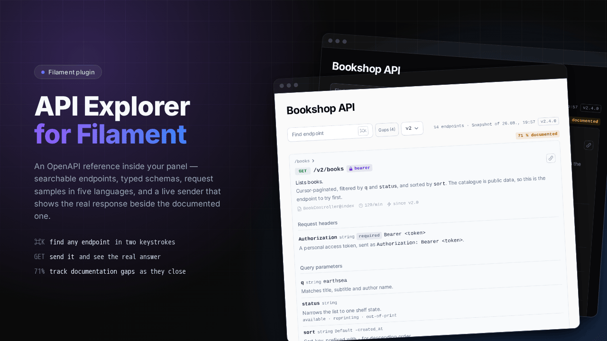
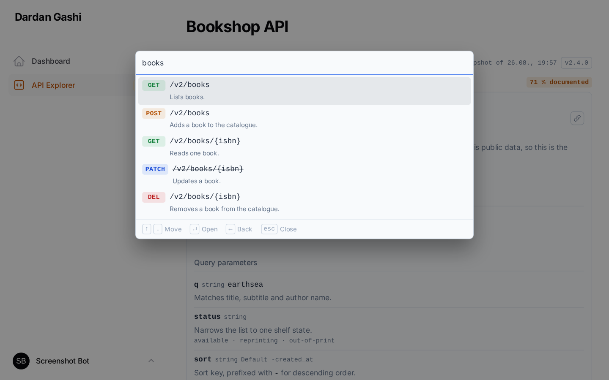
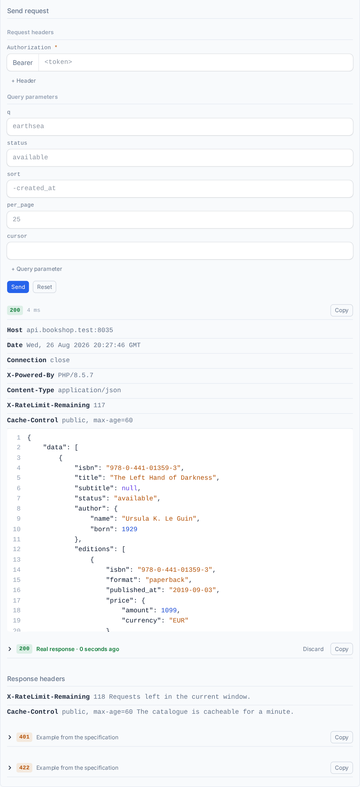
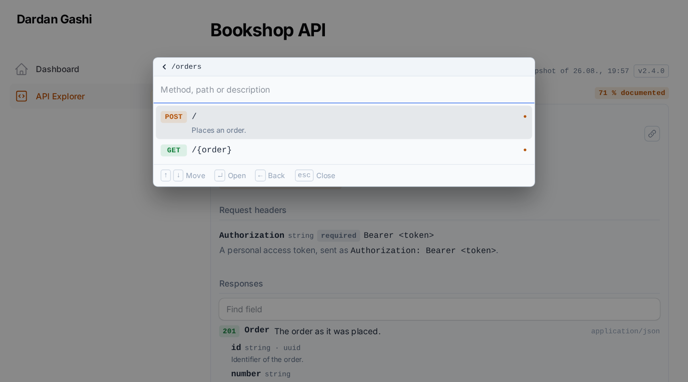

# 🔍 Filament API Explorer

An OpenAPI-driven API reference inside a [Filament](https://filamentphp.com) panel. Find any endpoint from a `⌘K` palette, read request and response schemas as a searchable tree, copy a request sample in five languages — and send a `GET` request to see the live response next to the documented one.

[](https://www.php.net/)
[](https://laravel.com)
[](https://filamentphp.com)
[](https://livewire.laravel.com/)
[](https://packagist.org/packages/dardangashi/filament-api-explorer)
[](https://packagist.org/packages/dardangashi/filament-api-explorer)
[](https://github.com/dardan-gashi/filament-api-explorer/actions/workflows/tests.yml)
[](https://codecov.io/gh/dardan-gashi/filament-api-explorer)
[](phpstan.neon)
[](LICENSE.md)

<!-- SCREENSHOT: hero -->
<div class="filament-hidden">

</div>

## 📥 Installation

```bash
composer require dardangashi/filament-api-explorer
php artisan filament:assets
```

Register the plugin on your panel:

```php
use DardanGashi\FilamentApiExplorer\ApiExplorerPlugin;

public function panel(Panel $panel): Panel
{
    return $panel
        // ...
        ->plugin(ApiExplorerPlugin::make());
}
```

The page is served at your panel's path plus `api-explorer` — `/admin/api-explorer` for a panel at `/admin` — and it is kept out of production panels until you ask for it. Access is your panel's business: whoever may open the panel may open the page, unless you narrow it with `authorizeUsing()`.

Run `php artisan filament:assets` after package updates and on deployment as well, unless your application already runs Filament's asset command for you.

## 🚀 Quick start

The package ships a fictional OpenAPI document so the page has something to open before you point it at your own API — a bookshop with books, orders, customers and a pair of exports, written so that every feature has something to show: a body offered as both JSON and XML, an XML-only export, a CSV one, two security schemes, deprecated and undocumented operations, and a coverage figure that is deliberately not 100 %.

```php
// config/filament-api-explorer.php
'sources' => [
    'v2' => [
        'driver' => 'file',
        'path' => base_path('vendor/dardangashi/filament-api-explorer/examples/bookshop-v2.json'),
    ],
    'v1' => [
        'driver' => 'file',
        'path' => base_path('vendor/dardangashi/filament-api-explorer/examples/bookshop-v1.json'),
    ],
],
```

Two documents, so the version picker has something to switch between: `v2` has fourteen endpoints and four gaps, `v1` has five and none. Nothing in either is a real service — the servers are `.test` hostnames, and a live request to them goes nowhere.

To publish the configuration file first:

```bash
php artisan vendor:publish --tag=filament-api-explorer-config
```

## ✨ Features

### 🎹 Find any endpoint from the keyboard

`⌘K` (or `Ctrl+K`) opens a two-level browser — resource, then endpoint — driven by the arrow keys and searched in the browser rather than over the wire. Type to match a method, path, summary or resource, `↑`/`↓` to move, `↵` to select, `Esc` to close. `→` opens a resource and `←` leaves it again, while the search box is empty, so typing still moves the cursor.

<!-- SCREENSHOT: command palette, open, with a search term typed and several matches visible -->
<picture>
  <source media="(prefers-color-scheme: dark)" srcset="docs/images/command-palette-dark.png">
  
</picture>

### 📡 Send a request and see the real answer

Fill in the path parameters and your credential, then Send. The response arrives beside the documented one and stays as this endpoint's example, so the schema skeleton is replaced by what the API actually returns. A credential you type follows you to the next endpoint that asks for the same header.

<!-- SCREENSHOT: live response — a sent request with status, timing and a real JSON body -->
<picture>
  <source media="(prefers-color-scheme: dark)" srcset="docs/images/live-response-dark.png">
  
</picture>

### 🕳️ See what is still undocumented

Five checks run against every endpoint. `Gaps` narrows the palette to the ones that leave a question open, and the badge beside it is the documented share of the whole API.

<!-- SCREENSHOT: coverage — the documented share in the header and the gap filter active -->
<picture>
  <source media="(prefers-color-scheme: dark)" srcset="docs/images/coverage-dark.png">
  
</picture>

### 🧰 Everything else

- 🌳 **Schemas as a tree** — request and response bodies with types, nullability and descriptions, and a field search that narrows them
- 🧾 **JSON and XML** — a body is written, coloured and indented in the format its media type declares, a body offered in both is a switch between them, and a live response is read as the format the server actually sent
- 📋 **Five request samples** — `curl`, raw HTTP, PHP, JavaScript `fetch` and Python `requests`, highlighted on the server with no highlighter in the browser
- 🗂️ **Several documents at once** — a version picker, `file`, `array` and `scramble` drivers, and a hook for your own
- 🏷️ **Vendor extensions** — any scalar `x-*` field on an operation becomes a caption under the endpoint title
- 🎨 **Filament-native** — field metrics read off Filament's own input CSS, the panel's primary colour, dark mode, and the page width the panel hands out
- 🔗 **Deep links** — the endpoint, the search term and the gap filter live in the query string, and an endpoint is addressed by its `operationId` (`?endpoint=v1.orders.show`), the same name every other reader of the document uses
- 🌍 **English and German** ship with it, resolved through Laravel's locale and fallback

## 📖 Reading the page

The toolbar says what you are reading: the source picker (a key of `sources`), how many endpoints the document has, when it was last generated, the version the API calls itself — `info.version`, in an outlined badge — and the documented share. Two versions in one row are two different things: the source is your name for a document, the badge is the document's name for the API.

The left column is the documentation: parameters, request body, responses, and every schema as a tree you can search and collapse. The right column is the request: a sample in the language you pick, and the sender underneath it. The headers a response promises — `Location`, `X-RateLimit-Remaining` — are listed under the example they belong to.

## 📄 Pointing it at a document

Each entry of `sources` is one OpenAPI document, and the key is the name shown in the version picker. The first entry is the one the page opens with.

```php
// config/filament-api-explorer.php
'sources' => [
    'v2' => ['driver' => 'file', 'path' => storage_path('api-docs/v2.json')],
    'v1' => ['driver' => 'file', 'path' => storage_path('api-docs/v1.yaml')],
],
```

The `file` driver reads JSON and YAML, so an l5-swagger or swagger-php setup is a path and needs no code at all.

A document small enough to live in configuration needs no file either — the `array` driver takes it inline, which is what a handful of hand-written endpoints and most tests want:

```php
'sources' => [
    'internal' => ['driver' => 'array', 'document' => [
        'openapi' => '3.1.0',
        'info' => ['title' => 'Internal endpoints', 'version' => '1.0.0'],
        'paths' => [/* … */],
    ]],
],
```

### ⚡ Scramble

[Scramble](https://scramble.dedoc.co) generates the OpenAPI document from your routes, and this package reads it straight out of the generator — so the reference describes the routes that are actually registered, rather than an export somebody forgot to re-run.

```php
'sources' => [
    'api' => [
        'driver' => 'scramble',
        'api' => 'default',
        'watch' => [app_path(), base_path('routes'), config_path()],
    ],
],
```

Generating a document costs about a second, far too much for a page that re-renders on every click, so the parsed specification is cached — and a cache needs to know when what it describes last changed. `watch` is the answer: the newest modification time among those paths dates the document. Editing a controller invalidates the cache by itself, a deployment that changes nothing keeps serving from it, and scanning a few hundred files costs about three milliseconds. It doubles as the snapshot time in the page header, because that is what it is.

The integration also adds the facts an OpenAPI schema has no field for, and puts back what Scramble drops:

- 🧭 **`x-handler`** — the action that answers the endpoint
- ⏱️ **`x-rate-limit`** — its throttle, as `600/min` or `100/h`
- 🔑 **`x-abilities`** — the token abilities the route insists on
- 📝 **The description** an operation loses the moment it is marked `@deprecated`

Those first three are the questions a reader asks straight away and would otherwise look up in `routes/api.php`, and the page reads them back as the captions under an endpoint title. Scramble also replaces an operation's description with the text of its `@deprecated` tag, which costs an endpoint its documentation the moment somebody marks it as going away; the integration puts both back, the description first and the notice after it. Set `scramble.facts` to `false` to leave the generated document exactly as Scramble wrote it.

Two things are worth knowing before you point a navigation badge at a generated document. The badge is rendered on *every* page of the panel, and `count` and `coverage` both need the whole document to compute — with a generator behind the source that means a full analysis per page view, so leave the badge off (the documented share is on the explorer's own page anyway). And prime the generator's cache in production with `php artisan scramble:cache`, so neither the page nor the badge pays for the analysis at request time.

If you would rather export to disk and use the `file` driver:

```bash
php artisan scramble:export --path=storage/api-docs/v2.json
```

Scramble is the one generator this package follows through their releases. It stays a *suggestion* rather than a requirement, because any JSON or YAML document on disk works as well.

### 🔧 Reading a document from somewhere else

Anything that has no file — a generator, an object store, an HTTP endpoint — is a driver you register from a service provider. The whole configuration entry reaches the resolver, so a driver takes the options it needs:

```php
use DardanGashi\FilamentApiExplorer\Contracts\SpecSource;
use DardanGashi\FilamentApiExplorer\Sources\SpecSourceManager;

$this->app->resolving(SpecSourceManager::class, function (SpecSourceManager $manager): void {
    $manager->extend('gateway', fn (string $name, array $config): SpecSource => new GatewaySpecSource(
        name: $name,
        stage: $config['stage'] ?? 'prod',
    ));
});
```

```php
'sources' => [
    'gateway' => ['driver' => 'gateway', 'stage' => 'staging'],
],
```

A driver may replace a built-in one — register `file` again and files are read your way from then on.

Two parts of `SpecSource` are worth more than they look. `generatedAt()` is what allows the parsed document to be cached across requests, and it is the snapshot time in the page header; a source that cannot date its document is parsed again on every render, which is the safe way round. And `SpecUnavailable` is the way to fail: the page renders a state for it that names the source and says why, while anything else bubbles up, so a document that cannot be built never takes the panel down with it.

## 🎛️ Configuring the plugin

Every option falls back to the configuration file, so a panel only states what it wants to differ:

```php
ApiExplorerPlugin::make()
    ->slug('developer/api')
    ->navigationLabel('API')
    ->navigationGroup('Developer')
    ->navigationIcon('heroicon-o-code-bracket-square')
    ->navigationSort(100)
    ->navigationBadge('coverage')          // count | coverage | version | null
    ->title('API Documentation')
    ->description('Browse the endpoints and try them out.')
    ->source('v2')                         // which source the page opens with
    ->fullWidth()                          // off by default: the panel decides
    ->requestSending()                     // allow live GET requests
    ->enabledInProduction()                // off by default
    ->authorizeUsing(fn (): bool => auth()->user()?->isDeveloper() ?? false);
```

The page takes the width your panel gives every other page. `fullWidth()` hands it the window instead, and nothing else changes: the two columns are laid out from the room they are actually given — a container query, not the window size — so an open sidebar or a panel of its own width does not leave them squeezed at the moment a viewport breakpoint says there is space.

## 🔗 The address of an endpoint

An endpoint is addressed by its `operationId`, which Scramble writes from the route name — so the page for `GET /v1/orders/{order}` is at `?endpoint=v1.orders.show`, and a document read by another tool addresses the same operation the same way. An operation without an id falls back to its method and path (`?endpoint=get-v1-orders-order`), and so does the second of two operations claiming one id, since an address that answers twice answers for neither. A link carrying the old method-and-path form keeps working either way.

## 🕳️ Documentation gaps

Coverage here is not "does the endpoint appear in the document" — every route does that by itself. It is whether the document answers the five questions a reader actually arrives with, and `Gaps` in the toolbar narrows the palette to the endpoints that leave one open. The share in the header is the same check counted the other way round: endpoints with *no* gap at all. At 100 % there is nothing to filter, so the button is disabled and says so.

| Badge | Raised when | What closes it |
| --- | --- | --- |
| No summary or description | the operation has neither | one sentence of PHPDoc |
| No response documented | the operation documents no response at all | a return type the generator can read, or `@response` |
| Success response without a schema | a `2xx` names a media type but nothing describes its body | return a resource or a typed value instead of an untyped array |
| Parameters without a description | a documented parameter carries no `description` | describe it where it is declared |
| No request body documented | the method carries a body and none is documented, or it has no schema | validate in a `FormRequest`, or in the action |

Two of those are worth a note. A parameter the explorer *inferred* — the authentication header it reads off a security scheme, for instance — is never counted: it is not in the document, so a missing description on it says nothing about the document. And the request-body check is why a `POST` cannot reach full coverage on its responses alone; without it the figure would call an endpoint documented while saying nothing about what it expects to be sent.

The gaps are the document's, so they close wherever the document comes from. With Scramble that is the controller, and this is an endpoint with four of the five:

```php
public function index(Request $request)
{
    return Order::query()
        ->when($request->string('status')->toString(), /* ... */)
        ->paginate()
        ->toArray();
}
```

No sentence, no described parameter, and an array whose shape nothing knows — `paginate()->toArray()` is documented as an object with no properties. The same endpoint with nothing left open:

```php
/**
 * Return a paginated list of orders.
 *
 * Supports filtering by status, source, payment status, and date range.
 *
 * @param  string  $status  Only orders in this status.
 */
public function index(OrderIndexRequest $request): AnonymousResourceCollection
{
    return OrderResource::collection(
        Order::query()->filter($request->validated())->paginate(),
    );
}
```

The first line is the summary, the paragraph under it the description, the `@param` tag the parameter description, and the return type is what lets the generator describe the body — one resource class documents every endpoint that returns it.

There is nothing to configure: the five checks are the same for every document, because a coverage figure you can widen until it reads 100 % measures nothing.

## 📋 Code samples

A sample is never written down. Every one is generated from the same blueprint the live sender uses, so what you copy is what the explorer would send, and no sample can fall behind a document that changed.

Samples are highlighted on the server — one pattern per language, one set of token colours for all of them, and no syntax-highlighting library in the browser. A credential is drawn as the variable it is, so the one thing you have to replace is the one thing that stands out.

| Tab | What it writes |
| --- | --- |
| `curl` | one option per line, `-G` where a `GET` carries parameters |
| `HTTP` | the request as it goes over the wire — runs in the HTTP client of PhpStorm and the REST Client of VS Code, imports into Postman |
| `PHP` | Laravel's HTTP client |
| `JS` | the browser's `fetch` |
| `Python` | `requests` |

Which library a language reaches for is yours to change — implement `RequestSnippet` and register it over the one that ships:

```php
app(SnippetRenderer::class)->register(new GuzzleSnippet);
```

A language of its own takes three things, and only the first is outside your reach: a case on `SnippetLanguage`, which is what the tab and the query string are keyed on, so that one is a change to this package. The other two are a `RequestSnippet` that writes the sample and a highlighter for it — and a highlighter is one regular expression whose named groups are the token classes, which `Highlighter` turns into the same colours every other language uses. See `src/Highlighting/SnippetHighlighter.php`, where the three meet.

## 📡 Sending requests

Where the document lists more than one server, the sender opens with a picker for them and every sample follows the choice, so a request is copied against the host you were reading it for.

**A header or a query parameter can be added by hand.** A document is not the whole truth about an API — a debug switch, a language, a filter nobody wrote down — so both sections carry a `+`, and what you add travels into the code samples as well as into the live request. An entry naming something documented replaces it, case-insensitively for headers, because `accept` and `Accept` are one header. A path parameter cannot be added: the template decides which of those exist, and every placeholder in it gets an input whether the document declares it or not — an undeclared one is an input and a documentation gap at the same time.

The request panel prefills each documented query parameter with its example, default or first allowed value. Header inputs stay empty on purpose: a documented header example is a placeholder, not a credential, so nothing is sent until you type it. Once typed, a header follows you to the next endpoint that asks for the same one — a token is typed to try an API, not one endpoint of it. It is held in the page and stored nowhere, so a reload asks again.

Sending runs server-side, and it is restricted on purpose:

- only safe methods — `GET`, `HEAD` and `OPTIONS`; every other method is documented but never sent
- only the schemes in `execution.allowed_schemes`
- only the hosts in `execution.allowed_hosts`, which defaults to the application's own host — which is the one host an explorer needs in order to try its own API, and the reason a document offering a production server refuses to be called from a laptop. Patterns such as `*.staging.example.com` are supported, and a refusal names the setting it came from, so there is nothing to look up
- redirects are not followed, so a `30x` cannot lead somewhere the policy would have refused
- credentials never reach the code samples: a header that carries one is rendered as the placeholder of its language — `$TOKEN`, `{{token}}`, `$token`, `${token}`, `f'…{token}'` — in the sample you copy
- an `Accept` header is always sent, and the sample carries the same one: the media type the endpoint documents, else `application/json`. Without it a Laravel API answers an unauthenticated request with a redirect to a login page rather than a `401`, and where no such page exists it fails while building the redirect and answers `500`. A document that declares its own `Accept` keeps it

```php
'execution' => [
    'enabled' => true,
    'allowed_hosts' => ['api.example.com', '*.staging.example.com'],
    'allowed_schemes' => ['https'],
    'timeout' => 10,
],
```

Set `enabled` to `false`, or call `->requestSending(false)`, to make the page a pure reference.

## 💾 Recorded examples

An example built from a schema is correct and worthless: it says `"status": "string"` where the API says `"status": "paid"`. So every response the explorer receives is kept and shown in place of that skeleton, one sample per status — the `200` of an endpoint and its `422` describe different shapes and both are worth reading. A sample can be discarded from the page, and the next live request replaces it.

Samples live in the cache, so a lost one costs nothing. What they hold is real response data, shown to everyone who can open the page, so switch capturing off where that is not acceptable:

```php
'examples' => [
    'capture' => true,
    'store' => null,      // cache store, null for the default
    'ttl' => 86400,
    'max_bytes' => 65536, // larger payloads are not kept
],
```

An example the document declares itself is used when nothing has been recorded; a skeleton built from the schema comes last and arrives collapsed, labelled as the structure it is.

## 🧾 JSON and XML

A body is written, coloured and indented in the format its media type declares, so an endpoint that answers `application/xml` is not documented with a JSON payload.

An example built from the schema of an XML body comes out as XML. A list repeats its element rather than wrapping it, which is what OpenAPI does unless a document says otherwise; an empty value is a closed element rather than nothing; and the root element takes its name from `xml.name`, else the schema's `title`, else `response`:

```xml
<?xml version="1.0" encoding="UTF-8"?>
<books>
  <data>
    <isbn>978-0-441-01359-3</isbn>
    <title>The Left Hand of Darkness</title>
    <subtitle/>
    <tags>science-fiction</tags>
    <tags>classics</tags>
  </data>
</books>
```

An example the document declares itself is passed through untouched, whatever format it is in: it was written in that format on purpose, and re-encoding it would be this package overruling the document.

A format neither of the two — `text/csv`, `text/plain`, anything else — is shown plainly rather than through another language's rules. JSON colours over CSV invent a structure that is not there, and a reader trusts colour. A vendor type counts by its suffix, so `application/vnd.api+json` is JSON and `application/atom+xml` is XML.

**A live response is read as the type the server named**, not as the one the document promised. The `Content-Type` of the answer decides how it is indented and coloured, so a document that says XML while the endpoint still answers JSON shows an XML example beside a JSON response — which is the truth about both. XML that does not parse is shown exactly as it arrived, because a parser's complaint would hide the very thing you are looking at.

**A body offered in several media types is offered as a choice.** A response whose `content` names both `application/json` and `application/xml` carries two bodies in OpenAPI — two schemas, two examples — and that body's head grows a switch where it otherwise prints its media type:

```yaml
responses:
  '200':
    content:
      application/json:
        schema: { $ref: '#/components/schemas/Order' }
      application/xml:
        schema: { $ref: '#/components/schemas/OrderXml' }
```

The choice carries the whole endpoint: the schema trees, the examples, the `Accept` header of every code sample and what the live request asks for. A switch that changed only the example would show XML and copy a request asking for JSON.

Two things it deliberately does not do. A body documented in one format only — the JSON error beside an XML payload — keeps its plain label and stays in the format it has, rather than being redrawn as one it never comes back as. And a format no response is documented in is never asked for: the media types of an endpoint include the ones its request body is *sent* as, and `multipart/form-data` earns a 406 from any correct server that is asked to answer in it.

## 🏷️ Vendor extensions

Any scalar `x-*` field on an operation is shown as a caption under the endpoint title, which is how a specification can surface details this package knows nothing about:

```yaml
paths:
  /v2/books:
    get:
      summary: Lists books with cursor pagination.
      x-handler: BookController@index
      x-rate-limit: 120/min
      x-since: v2.0
```

## 🌳 Schema depth

A schema tree is expanded to `schema.max_depth` levels and stops there. Six is the default, and the reason it exists is recursion: a category with a parent that is a category describes an infinitely deep tree, and something has to decide when to stop drawing it. The limit applies to the examples too, since they are built from the same tree.

```php
'schema' => ['max_depth' => 6],
```

## ⚡ Caching

Parsing is repeated on every page load unless you turn the cache on. The cache key carries the document's last-modified time, so a regenerated document is picked up without anybody clearing a cache:

```php
'cache' => ['enabled' => true, 'store' => null, 'ttl' => 300],
```

## 🚧 Not yet included

- 🍪 **Cookies** are documented but get no input in the request panel.
- 📤 **Sending a body.** A request body is documented and rendered for every method, but only safe methods are ever sent, so there is nothing to fill in.

## 🛠️ Development

```bash
composer install
composer check     # pint --test, phpstan level 8, pest
```

Filament copies the stylesheet into the host application's `public/` directory, so after editing `resources/css/api-explorer.css` the copy has to be refreshed — otherwise the panel keeps serving the old one:

```bash
php artisan filament:assets
```

## 🔒 Security

Please report security issues through [GitHub's private vulnerability reporting](https://github.com/dardan-gashi/filament-api-explorer/security/advisories/new) rather than a public issue. See [SECURITY.md](SECURITY.md).

## 📝 License

MIT. See [LICENSE.md](LICENSE.md).
